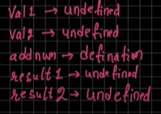
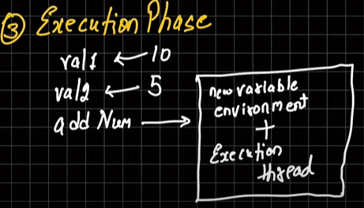

## JavaScript Execution Context

### Two Types of Execution Context:

- Global Execution Context
- Function Execution Context
- Eval Execution Context (Optional, because it is a property of Global EC)

**Remember** :

> When we give any code to JS , the first thing that is created is **_Global Execution Context_** which is referred by `this` variable.
> And in browser value of `this` is
> `Window {window: Window, self: Window, document: document, name: '', location: Location, …}` object

> JS is **_singlethreaded_**

## Two Phases:

- #### Memory Creation Phase (or Memory Phase or Creation Phase) :-
  - In this phase , the memory for all your variables , etc, is allocated BUT not EXECUTED. Also known as memory allocation.
- #### Execution Phase :
  - In this phase, all your operations or code execution happens here.

---

#### Example:

```js
let val1 = 10;
let val2 = 5;
function sum(num1, num2) {
  return num1 + num2;
}

let result1 = sum(val1, val2);
let result2 = sum(2, 3);
```

##### Steps of execution of this code:

- **Phase-1 :** (Always Happens) **Global Execution Phase** (which is allocated inside `this` keyword)

- **Phase-2 :** **Memory Phase** (where all variables are allocated in the memory)

  - all the variables are stored as undefined like 

- **Phase-3:** **Execution Phase** (where all the execution happens)
  - 
